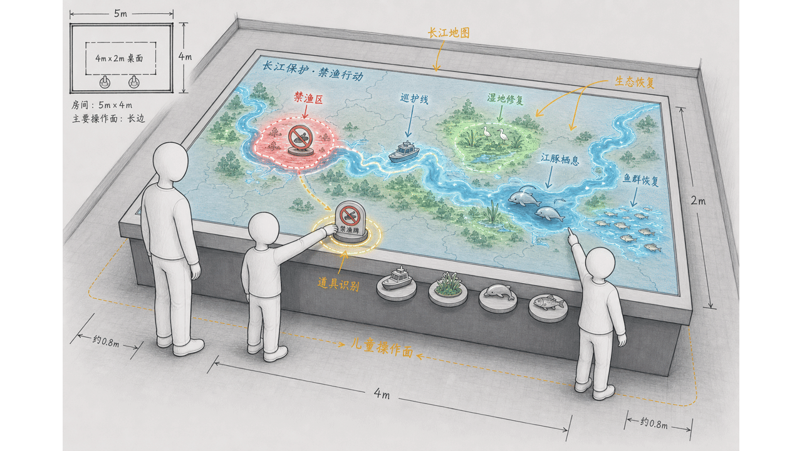
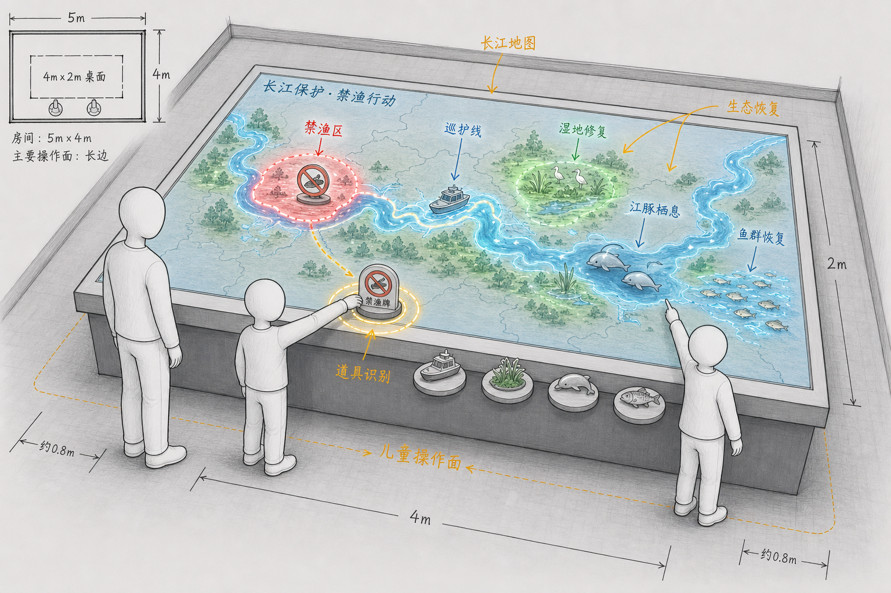
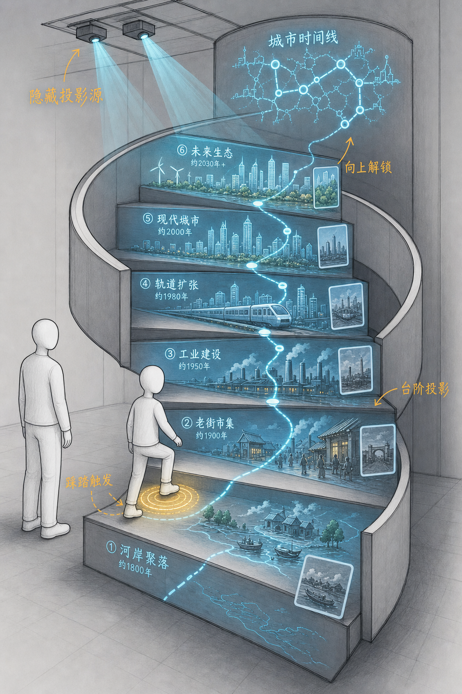

# Exhibit Interaction Diagram Skill

> 把一句展项创意，变成一张别人 3 秒能看懂怎么玩的装置交互图。

[](SKILL.md)
[](https://skills.sh/logic0512/exhibit-interaction-diagram)
[](LICENSE)

**用于生成、扩展和质检展览多媒体互动装置概念图，重点不是漂亮效果图，而是清楚表达“人怎么参与、触发了什么、反馈在哪里、内容表达什么”。**

[效果示例](#效果示例) · [快速开始](#快速开始) · [触发方式](#触发方式) · [工作链路](#工作链路) · [验证与测试](#验证与测试) · [安全边界](#安全边界)

---



<sub>两个真实测试案例：长江禁渔互动桌、旋转步行阶梯城市时间线。</sub>

---

## 它解决什么问题

展项装置图很容易变成三种东西：漂亮但看不懂怎么玩的效果图、堆满设备的硬件清单、或者只有屏幕 UI 的概念稿。

这个 skill 把展项创意先拆成“人 - 触发 - 反馈 - 结果”，再结合空间大小、亮度、设备距离、人体可达范围和信息内容，生成一张能沟通玩法的装置交互图。

它也内置了人物、动作、载体、结果反馈的 atomic assets，用来稳定人物风格和载体识别，避免每次生图都漂成不同画风。

---

## 效果示例

### 示例 1：长江禁渔互动桌

输入：

```text
我有一个长5米，宽4米的空间。在空间的中间，我想做一个宽2米，长4米的互动桌。在这个互动桌上，可以进行交互，了解关于长江禁渔的相关保护措施，长江的生态资源面貌。设置不同的道具，跟桌面的屏幕进行结合互动。
```

输出图：



质检结果：

- 人物、儿童身高和桌面尺度能支撑玩法。
- 道具触发区、桌面地图、禁渔区、巡护线、湿地修复、江豚栖息和鱼群恢复都有对应关系。
- 没有额外加入无关大屏、投影或设备清单。

### 示例 2：旋转步行阶梯城市时间线

输入：

```text
我想做一个扶梯上的交互展项，能让孩子在旋转式的行走阶梯上走动的过程触发信息，了解一座城市的发展脉络。可以做投影，投在扶梯上。
```

输出图：



质检结果：

- 明确表达了旋转式行走阶梯，不是电动扶梯。
- 儿童脚下触发点、投影源、台阶内容和城市时间线反馈关系清楚。
- 投影内容不是空白光效，而是城市发展阶段、年代和代表场景。

---

## 快速开始

### 方式 1：从 GitHub 安装

仓库公开后可用：

```bash
npx skills add logic0512/exhibit-interaction-diagram
```

装完对 Agent 说：

```text
Use $exhibit-interaction-diagram to 把这个展项创意生成一张清晰能看懂玩法的装置交互图：{你的创意}
```

### 方式 2：手动安装

把本目录复制到你的 skills 目录，例如：

```bash
cp -R exhibit-interaction-diagram ~/.codex/skills/
```

然后用同样的触发句调用。

---

## 触发方式

- “把这个展项创意画成一张能看懂玩法的装置交互图。”
- “我只有一个主题，帮我扩展成可互动、可画出来的方案。”
- “这张装置图看起来不落地，帮我检查设备距离和人能不能操作。”
- “帮我做一个屏幕/投影/灯光/声音/机械互动展项的概念图。”
- “我想做儿童展项，要体现孩子身高和视角。”
- “不要只做效果图，要让客户看懂怎么玩。”

---

## 工作链路

这个 skill 有四种使用路径：

| 路径 | 适合情况 | 交付物 |
|---|---|---|
| 直接生图 | 已经有明确装置、动作、反馈和空间条件 | 一张玩法清楚的装置交互图 |
| 辅助表达 | 只有方向，玩法还没成型 | 1 个补全后的互动方案，再进入生图 |
| 创意扩展 | 只有主题、内容、目标人群或空间诉求 | 2-3 个互动方向，并推荐最适合画图的方案 |
| 失败复盘 | 已有图效果不对 | 按人物、设备距离、可达范围、空间秩序、反馈内容做质检 |

核心生成链路：

```text
用户创意
→ prompt-brief.md 结构化判断
→ 选择人物和必要 atomic assets
→ runtime-prompt.md 组装最终生图提示词
→ image generation
→ qa-checklist.md 质检迭代
```

---

## 它和普通生图提示词有什么不同

| 维度 | 普通提示词 | 本 skill |
|---|---|---|
| 目标 | 生成好看的概念图 | 生成能看懂玩法的装置交互图 |
| 人物 | 可有可无，容易漂移 | 人物强制参与核心动作，并锁定统一视觉层 |
| 设备 | 常被画成抽象发光物 | 要符合常见展陈硬件逻辑、安装方式和工作距离 |
| 空间 | 容易忽略尺度和亮度 | 先判断空间大小、亮度、人流、儿童尺度和载体适配 |
| 反馈内容 | 常见空屏、蓝色 UI、泛光效 | 屏幕/投影/灯光/声音/机械反馈必须承载主题信息 |
| 失败处理 | 靠重新描述 | 有 qa-checklist、validation-rubric 和 test-prompts 回归样例 |

---

## 文件结构

```text
SKILL.md                         # 主工作流
README.md                        # GitHub 说明和 showcase
LICENSE                          # MIT license
agents/openai.yaml               # Agent 界面元信息
references/                      # 规则、模板、质检和空间/硬件约束
references/prompt-brief.md       # 生图前的结构化判断母版
references/runtime-prompt.md     # 最终生图短提示词母版
assets/visual-system/atomic/     # 人物、动作、载体、结果的单意图资产
assets/examples/                 # 完成图 examples，只做低频图面校准
examples/showcase/               # 公开 README 使用的稳定案例图
test-prompts.json                # 回归测试案例
scripts/check-test-prompts.py    # 测试样例结构检查
```

`outputs/` 是本地测试输出目录，不进入发布仓库。

---

## 验证与测试

结构检查：

```bash
python3 scripts/check-test-prompts.py
```

发布前建议至少 dry-run 或真实生图这 3 个核心案例：

- `T01_tree_spotlight_lightweight_regression`
- `T02_yangtze_fishing_ban_table`
- `T08_abstract_concept_to_action`

评分使用 `references/validation-rubric.md`。低于 80 分不要视为通过。

---

## 安全边界

- 不自动发布、不上传、不调用外部 API。
- 不把私人素材路径写进提示词。
- 不把本地 `outputs/` 测试图当成 active assets。
- 不把任何未授权材料里的具体案例复制成最终图。
- 不把装置图做成施工图、弱电系统图或可直接制造的工程图。
- 如果用户给出的空间、亮度或硬件条件不足以支撑某个载体，会先补假设或提示限制。

---

## 当前状态

这是 `v0.1-alpha` 封装版，已经具备：

- 出图工作流
- 人物锁定
- 空间匹配
- 硬件落地
- atomic assets
- finished examples
- showcase 案例图
- 回归测试样例

正式公开推广前，建议继续补：真实安装输出截图、GitHub release notes、skills.sh 页面渲染检查和 marketplace 发布检查。

## License

[MIT](LICENSE)
